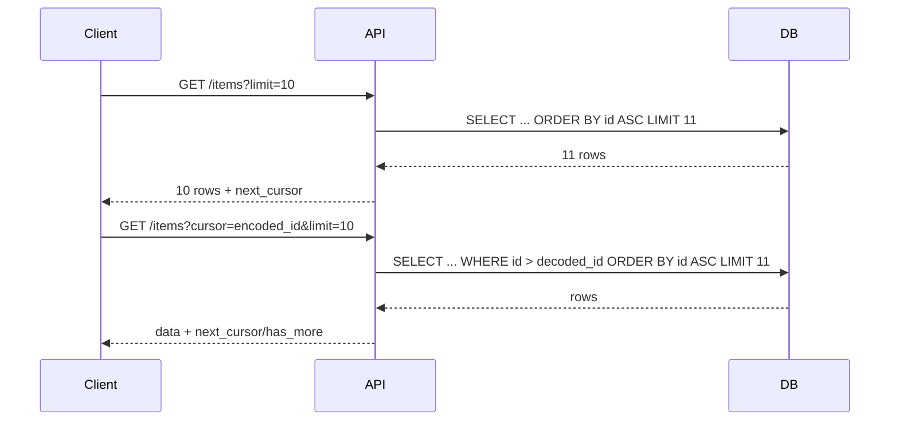

# Cursor Pagination (FastAPI + SQLAlchemy)

This folder documents a production-style cursor pagination pattern for FastAPI APIs.

## Why Cursor Pagination?

Offset pagination (`?page=3&limit=20`) is simple but can become slow and unstable on large, changing datasets.

Cursor pagination uses a pointer to the last seen item and is better for:

- High-volume tables
- Infinite scroll UIs
- APIs that need stable page boundaries while new rows are inserted

## Cursor vs Offset

| Strategy | Query Pattern | Pros | Cons |
|---|---|---|---|
| Offset | `LIMIT 20 OFFSET 40` | Easy to implement | Slower at scale, can skip/duplicate rows when data changes |
| Cursor | `WHERE id > last_id LIMIT 20` | Fast with index, stable ordering | Requires cursor encoding/decoding logic |

## Recommended Response Shape

```json
{
  "data": [
    {"id": 101, "name": "Product 101"}
  ],
  "next_cursor": "eyJpZCI6MTAxfQ==",
  "has_more": true
}
```

- `next_cursor`: opaque string passed back by clients
- `has_more`: boolean so clients know whether to request another page

## Request Flow



## Suggested Utility Design

Create a reusable helper with:

- `encode_cursor(last_id: int) -> str`
- `decode_cursor(cursor: str) -> int`
- `paginate(query, cursor: str | None, limit: int)`

Implementation notes:

1. Decode cursor safely (raise `HTTPException(400)` for invalid cursor)
2. Apply `WHERE id > decoded_id`
3. Fetch `limit + 1` rows to detect `has_more`
4. Return first `limit` rows
5. Build `next_cursor` from last row ID only when more rows exist

## API Usage Example

First request:

```bash
curl "http://127.0.0.1:8000/items?limit=3"
```

Next page:

```bash
curl "http://127.0.0.1:8000/items?limit=3&cursor=eyJpZCI6M30="
```

## Production Tips

- Always sort by a unique indexed column (usually `id` or `(created_at, id)`)
- Keep cursor opaque (base64-encoded payload)
- Validate `limit` (e.g., min 1, max 100)
- Return consistent schema (`data`, `next_cursor`, `has_more`)
- Include integration tests for first-page, middle-page, and end-page behavior

## Troubleshooting

- **400 invalid cursor**: client is sending malformed/expired cursor string
- **duplicate rows**: ordering column not unique
- **missing rows**: cursor comparator mismatch (`>` vs `>=`)
- **slow query**: missing DB index on ordered/filtered columns
