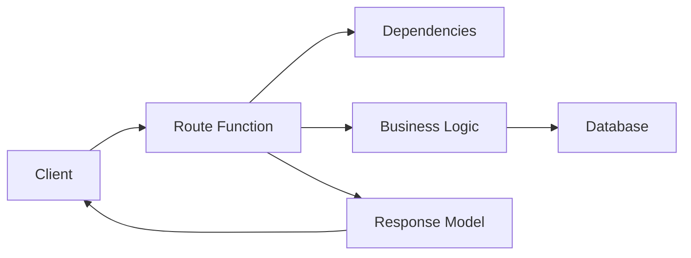

# FastAPI Concepts Handbook

A practical, beginner-friendly and production-oriented FastAPI knowledge base.

## Contents

- `concepts.md` - Core FastAPI building blocks
- `advanced.md` - Middleware, lifespan, performance, security basics
- `testing.md` - Unit/integration testing patterns for APIs
- `deployment.md` - Production deployment checklist and runbook

## Learning Path

1. Read `concepts.md`
2. Implement one endpoint with validation + response model
3. Add one dependency and one error handler
4. Read `testing.md` and add API tests
5. Apply `deployment.md` checklist before release

## FastAPI Mental Model

## Why FastAPI?

- Type hints drive validation and docs
- Automatic OpenAPI docs (`/docs`)
- High performance (ASGI + Starlette + Pydantic)
- Clean dependency injection model
