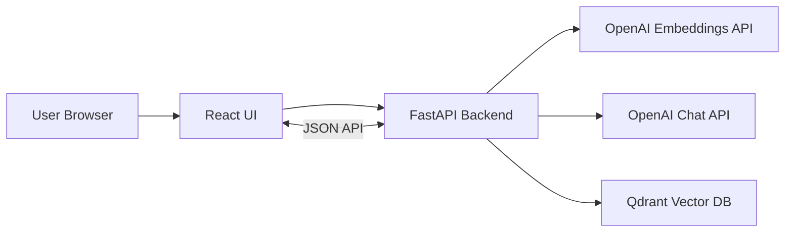

# Fullstack RAG (FastAPI + React + Qdrant + OpenAI)

A complete document-chat project where users upload a PDF/TXT file, the backend creates embeddings, and users ask grounded questions from a React UI.

## Architecture Decisions

### 1) LLM/Embedding Stack (Chosen)
- **OpenAI embeddings**: `text-embedding-3-small`
- **OpenAI chat model**: `gpt-4o-mini`
- **Vector DB**: Qdrant

Why:
- Fast to implement and production-proven API ergonomics
- High quality embeddings and chat completions
- Clear migration path to alternative providers later

### 2) Scope (Chosen)
- **Single-user MVP** (no auth)
- Goal: fastest end-to-end learning and working baseline

Future extensions are listed in the roadmap section.

## System Diagram



## Project Structure

```text
fullstack-rag/
├── backend/
│   ├── app/
│   │   ├── main.py
│   │   ├── api/routes/
│   │   ├── core/
│   │   ├── db/
│   │   ├── schemas/
│   │   └── services/
│   ├── .env.example
│   └── requirements.txt
├── frontend/
│   ├── src/
│   ├── package.json
│   └── vite.config.ts
├── docker-compose.yml
└── README.md
```

## Backend Features

- `POST /api/documents/upload`
  - Accepts PDF/TXT
  - Extracts text
  - Splits text into chunks
  - Creates embeddings
  - Upserts vectors into Qdrant

- `POST /api/chat`
  - Embeds question
  - Retrieves top-k chunks from Qdrant
  - Builds grounded context
  - Generates answer with citations

- `GET /health`
  - Simple service health endpoint

## Frontend Features

- Upload panel for PDF/TXT
- Chat panel for Q&A
- Source citation rendering per answer
- Loading and error states

## API Contracts

### Upload Document

`POST /api/documents/upload` (multipart form-data)

Request:
- `file`: PDF or TXT

Response:
```json
{
  "document_id": "f2c0e5e2-3d2c-4580-a0ca-9a9a3f6d3390",
  "filename": "sample.pdf",
  "chunks_indexed": 42,
  "status": "indexed"
}
```

### Chat

`POST /api/chat`

Request:
```json
{
  "question": "Give me a short summary of the project",
  "document_id": "f2c0e5e2-3d2c-4580-a0ca-9a9a3f6d3390",
  "top_k": 5
}
```

Response:
```json
{
  "answer": "The project is a solar initiative...",
  "citations": [
    {
      "document_id": "f2c0e5e2-3d2c-4580-a0ca-9a9a3f6d3390",
      "filename": "sample.pdf",
      "chunk_index": 3,
      "source": "sample.pdf",
      "page": null,
      "score": 0.87,
      "snippet": "Project Information Memorandum..."
    }
  ],
  "retrieved_chunks_count": 5
}
```

## Local Setup

## 1) Start Qdrant

```bash
cd fullstack-rag
docker compose up -d
```

## 2) Run Backend

```bash
cd fullstack-rag/backend
source ../../venv/bin/activate
pip install -r requirements.txt
cp .env.example .env
# Edit .env and set OPENAI_API_KEY
uvicorn app.main:app --reload --port 8000
```

Backend docs:
- Swagger: `http://127.0.0.1:8000/docs`

## 3) Run Frontend

```bash
cd fullstack-rag/frontend
npm install
npm run dev
```

Frontend:
- `http://127.0.0.1:5173`

## Environment Variables

Create `fullstack-rag/backend/.env`:

```env
OPENAI_API_KEY=your_openai_api_key_here
OPENAI_EMBEDDING_MODEL=text-embedding-3-small
OPENAI_CHAT_MODEL=gpt-4o-mini
QDRANT_URL=http://localhost:6333
QDRANT_COLLECTION=documents
MAX_UPLOAD_BYTES=10485760
CHUNK_SIZE=900
CHUNK_OVERLAP=150
TOP_K_DEFAULT=5
```

## Error Handling and Response Format

The backend includes centralized handlers for:
- Validation errors (`422`)
- Explicit HTTP errors (`4xx`)
- Unexpected exceptions (`500`)

Standard error payload:
```json
{
  "error": "validation_error",
  "details": "..."
}
```

## Troubleshooting

- **`Connection refused` on Qdrant**
  - Ensure `docker compose up -d` ran inside `fullstack-rag/`
  - Check `http://localhost:6333` is reachable

- **`OPENAI_API_KEY` errors**
  - Confirm `.env` exists in `backend/`
  - Ensure key is valid and not expired

- **Upload works but chat returns no results**
  - Verify `document_id` is passed in chat request
  - Increase `top_k`
  - Check chunking params (`CHUNK_SIZE`, `CHUNK_OVERLAP`)

- **CORS errors in browser**
  - Ensure frontend runs on `localhost:5173`
  - Backend CORS whitelist includes frontend origin

- **Large file failures**
  - Increase `MAX_UPLOAD_BYTES` in `.env`

## Production Notes

- Add authentication and per-user document isolation
- Move from local file upload handling to object storage (S3/GCS)
- Add background indexing jobs for large documents
- Add chat history persistence
- Add monitoring, tracing, and retries for external API calls

## Roadmap (Next)

1. Multi-user auth (JWT/session)
2. Workspace-level document collections
3. Async ingestion queue (RQ/Celery)
4. RAG evaluation suite (faithfulness/relevancy)
5. Streaming chat responses in UI
