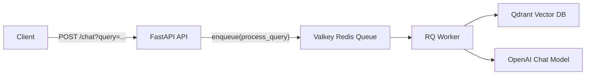

# RAG Queue (FastAPI + Valkey/Redis + RQ)

This folder provides an async RAG request pipeline:

1. FastAPI accepts a query
2. Query is enqueued in RQ
3. Worker processes retrieval + LLM call
4. API immediately returns job metadata

## Architecture



## Files

| File | Purpose |
|---|---|
| `server.py` | FastAPI app; enqueues incoming query jobs |
| `main.py` | Runs FastAPI app on `0.0.0.0:8080` |
| `queues/worker.py` | Executes RAG pipeline and returns answer |
| `client/rq_client.py` | Shared RQ connection (`localhost:6379`) |
| `docker-compose.yml` | Starts Valkey (Redis-compatible queue backend) |

## API

### POST `/chat`

Query parameter:
- `query` (string, required)

Example:

```bash
curl -X POST "http://127.0.0.1:8080/chat?query=short%20summary"
```

Example response:

```json
{
  "job_id": "a1b2c3d4",
  "status": "queued"
}
```

## Startup Order

From project root:

```bash
# 1) Start queue backend
cd rag-queue
docker compose up -d

# 2) Start API
source ../venv/bin/activate
python main.py

# 3) In another terminal, start worker
cd rag-queue
source ../venv/bin/activate
rq worker
```

## How `process_query` Works

`queues/worker.py` performs:

1. Similarity search in Qdrant (`djermaya_solar` collection)
2. Context assembly with page content, page label, and source
3. Prompted OpenAI call using retrieved context
4. Returns final answer string

## Troubleshooting

- **500 Internal Server Error on `/chat`**
  - Ensure Valkey is running: `docker ps`
  - Confirm Redis port is `6379` in both `docker-compose.yml` and `client/rq_client.py`
- **Jobs enqueued but never processed**
  - Worker is not running; start `rq worker` in a separate terminal
- **Worker errors on retrieval**
  - Qdrant may be down or collection missing; validate `http://localhost:6333` and collection existence
- **OpenAI auth errors**
  - Ensure `.env` contains valid API key and shell has loaded env vars

## Production Notes

- Replace in-memory local hostnames with service names in Docker/Kubernetes
- Add retry/backoff and dead-letter queue strategy
- Store job results in persistent backend for status polling endpoints
